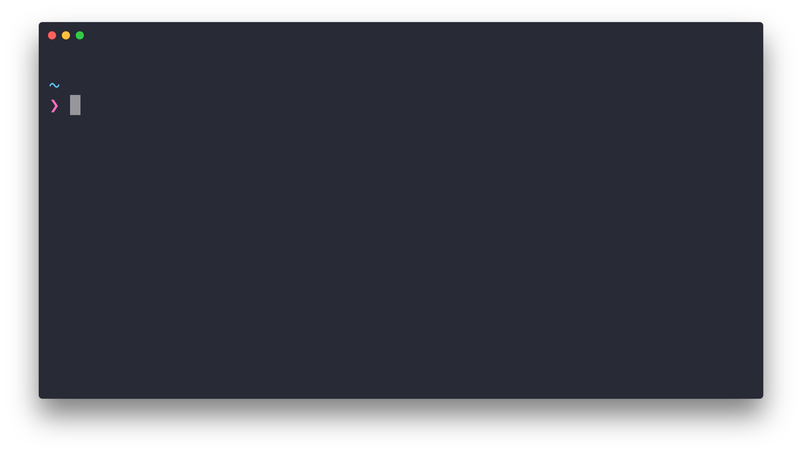

# hyper-hide-title

> Hide the [Hyper](https://hyper.is) window title when there is only one tab

The title isn't very useful when you only have one tab as you can already see what's happening.




## Install

```
$ hyper install hyper-hide-title
```


## Tip

The screenshot is using the [hyper-snazzy](https://github.com/sindresorhus/hyper-snazzy) theme, [Pure](https://github.com/sindresorhus/pure) prompt, and Menlo font. You don't need this plugin if you're using `hyper-snazzy` as it's already included.


## License

MIT © [Sindre Sorhus](https://sindresorhus.com)
